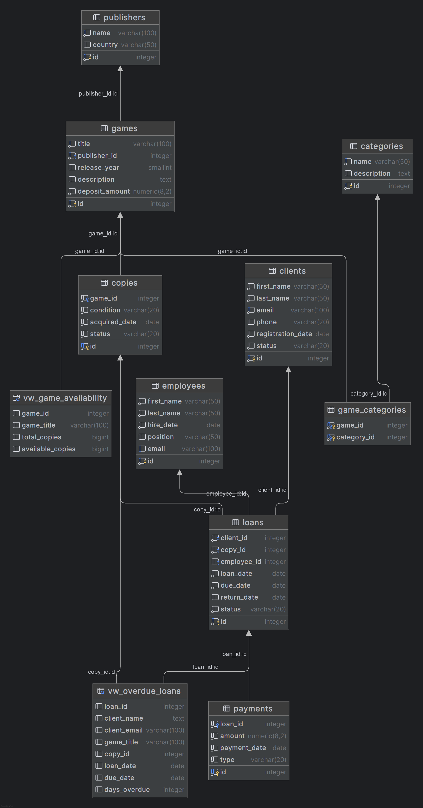

# System Bazy Danych Wypożyczalni Gier Planszowych 🎲

**Projekt zaliczeniowy z przedmiotu:** Bazy Danych (Teleinformatyka AGH)

**Autorzy:** Arkadiusz Baran, Maciej Miłek
---

## 1. Opis Projektu
System służy do kompleksowej obsługi wypożyczalni gier planszowych. Baza danych została zaprojektowana w środowisku **PostgreSQL** i umożliwia:
- Ewidencjonowanie gier, egzemplarzy oraz ich stanu technicznego.
- Zarządzanie bazą klientów i historią ich wypożyczeń.
- Automatyzację procesów finansowych (naliczanie kaucji oraz kar za opóźnienia).
- Raportowanie dostępności gier w czasie rzeczywistym.

Projekt realizuje wymagania na ocenę 4.0 poprzez zastosowanie rozbudowanej struktury tabel (9 encji), widoków oraz logiki biznesowej po stronie serwera (triggery i funkcje).

---

## 2. Struktura Bazy Danych
Baza składa się z **9 tabel** powiązanych relacjami, co zapewnia zgodność z zasadami normalizacji (3NF).

### Schemat ERD (Entity Relationship Diagram)

### Lista Tabel
| Tabela | Opis |
| --- | --- |
| `games` | Katalog tytułów gier (tytuł, rok wydania, kaucja). |
| `copies` | Fizyczne egzemplarze gier (stan, status dostępności). |
| `clients` | Dane osobowe klientów wypożyczalni. |
| `loans` | Rejestr wypożyczeń (kluczowy proces biznesowy). |
| `payments` | Historia transakcji finansowych (kaucje, kary). |
| `employees` | Pracownicy obsługujący system. |
| `publishers` | Słownik wydawców. |
| `categories` | Słownik kategorii gier. |
| `game_categories` | Tabela łącząca (relacja wiele-do-wielu). |

---

## 3. Logika Biznesowa (Triggery i Funkcje)

W systemie zaimplementowano mechanizmy automatyzujące logikę biznesową (Business Logic) bezpośrednio w bazie danych.

### A. Blokada podwójnego wypożyczenia (Trigger)
Trigger `prevent_duplicate_loan` zapobiega sytuacji, w której jeden egzemplarz gry jest wypożyczany dwóm klientom jednocześnie. Jeśli egzemplarz nie został zwrócony, system blokuje nową transakcję, zgłaszając wyjątek.

### B. Automatyczne naliczanie kar (Trigger)
Trigger `apply_overdue_fine` uruchamia się automatycznie przy zwrocie gry. System porównuje datę zwrotu z terminem (`due_date`). Jeśli termin został przekroczony, system wylicza karę (stawka dzienna * liczba dni) i dodaje odpowiedni wpis do tabeli `payments`.

### C. Procedura wypożyczenia (Funkcja)
Funkcja `create_loan(client_id, copy_id, days)` upraszcza proces dodawania rekordu. Automatycznie wylicza datę zwrotu na podstawie długości wypożyczenia i obsługuje logikę kaucji (dodaje wpis płatności, jeśli gra tego wymaga).

---

## 4. Scenariusze Testowe (Dowód Działania)

Poniższe testy potwierdzają poprawność zaimplementowanej logiki oraz spełnienie wymagań projektowych.

### Scenariusz 1: Próba wypożyczenia zajętego egzemplarza
**Cel:** Weryfikacja działania triggera `prevent_duplicate_loan`.
**Działanie:** Próba wypożyczenia egzemplarza, który posiada status aktywnego wypożyczenia (nie został zwrócony).
**Kod SQL:**

    SELECT create_loan(2, 1, 3); -- Klient 2 próbuje wypożyczyć zajęty egzemplarz nr 1

**Wynik:** System zwraca błąd, operacja zostaje zablokowana przez trigger.

### Scenariusz 2: Zwrot po terminie i automatyczne naliczenie kary
**Cel:** Weryfikacja triggera `apply_overdue_fine`.
**Działanie:** Symulacja zwrotu gry 5 dni po terminie.
**Kod SQL:**

    -- Symulacja opóźnienia (zmiana daty due_date wstecz)
    UPDATE loans SET due_date = CURRENT_DATE - 5 WHERE id = [ID_WYPOZYCZENIA];
    -- Dokonanie zwrotu
    UPDATE loans SET return_date = CURRENT_DATE WHERE id = [ID_WYPOZYCZENIA];
    -- Sprawdzenie czy naliczono karę
    SELECT * FROM payments WHERE type = 'kara' ORDER BY id DESC LIMIT 1;

**Wynik:** System automatycznie dodał rekord do tabeli płatności z kwotą 25.00 PLN (5 dni * 5.00 PLN).

### Scenariusz 3: Raport dostępności gier (Advanced SQL)
**Cel:** Weryfikacja poprawności złączeń (`JOIN`) i agregacji danych (`GROUP BY`).
**Działanie:** Wyświetlenie listy gier wraz z wydawcą oraz liczbą dostępnych sztuk w magazynie.
**Kod SQL:**

    SELECT 
        g.title AS "Tytuł",
        p.name AS "Wydawca",
        count(CASE WHEN c.status = 'DOSTĘPNY' THEN 1 END) AS "Dostępne sztuki"
    FROM games g
    JOIN publishers p ON g.publisher_id = p.id
    LEFT JOIN copies c ON g.id = c.game_id
    GROUP BY g.title, p.name
    ORDER BY "Dostępne sztuki" DESC;

**Wynik:** Poprawnie wygenerowany raport magazynowy.

---
