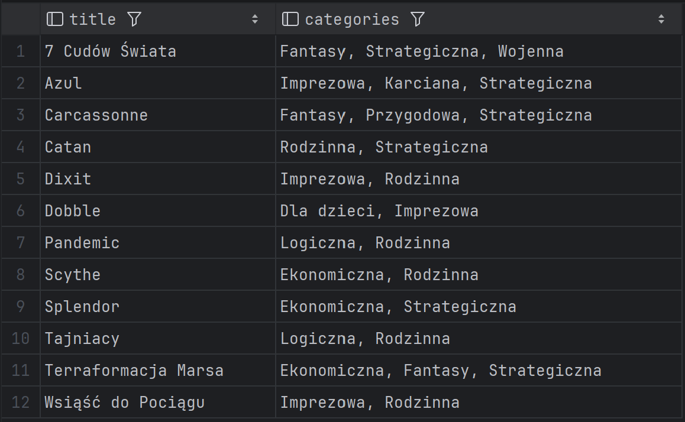

# System Bazy Danych Wypożyczalni Gier Planszowych 🎲

**Projekt:** Relacyjna baza danych (PostgreSQL) dla wypożyczalni gier planszowych 
**Autorzy:** Arkadiusz Baran, Maciej Miłek

---

## 0. Jak uruchomić projekt (Quick Start)

**Wymagania:**
- PostgreSQL (np. 14+)
- `psql`

### Import bazy danych

> Ten wariant jest najbardziej przenośny (nie zakłada konkretnych ról/ownerów z serwera).

```bash
createdb board_game_rental_system
psql -d board_game_rental_system -v ON_ERROR_STOP=1 -f migrations/001_schema.sql
psql -d board_game_rental_system -v ON_ERROR_STOP=1 -f migrations/002_seed.sql
```

> Import bazy danych (alternatywnie: pełny dump database.sql)

```bash
createdb board_game_rental_system
psql -d board_game_rental_system -f database.sql
```
*Uwaga: database.sql może zawierać polecenia typu ALTER ... OWNER TO ... (dump z serwera).
Jeśli import na innym koncie PostgreSQL zgłasza błąd braku roli/owner’a, użyj wariantu z migrations/.*


### Szybkie sprawdzenie działania

```sql
SELECT COUNT(*) FROM games;
SELECT * FROM vw_game_availability ORDER BY title;
```

---

## 1. Opis Projektu
System służy do kompleksowej obsługi wypożyczalni gier planszowych. Baza danych została zaprojektowana w środowisku **PostgreSQL** i umożliwia:
- Ewidencjonowanie gier, egzemplarzy oraz ich stanu technicznego.
- Zarządzanie bazą klientów i historią ich wypożyczeń.
- Automatyzację procesów finansowych (naliczanie kaucji oraz kar za opóźnienia).
- Raportowanie dostępności gier w czasie rzeczywistym.

Projekt prezentuje projekt relacyjnej bazy danych dla wypożyczalni gier, wraz z logiką biznesową po stronie PostgreSQL (widoki, triggery, funkcje) i scenariuszami testowymi.

---

## 2. Struktura Bazy Danych
Baza składa się z **9 tabel** powiązanych relacjami, co zapewnia zgodność z zasadami normalizacji (**3NF**).

### Schemat ERD (Entity Relationship Diagram)


### Lista Tabel
| Tabela | Opis |
| --- | --- |
| `games` | Katalog tytułów gier (tytuł, rok wydania, kaucja). |
| `copies` | Fizyczne egzemplarze gier (stan, status dostępności). |
| `clients` | Dane osobowe klientów wypożyczalni. |
| `loans` | Rejestr wypożyczeń (kluczowy proces biznesowy). |
| `payments` | Historia transakcji finansowych (kaucje, kary). |
| `employees` | Pracownicy obsługujący system. |
| `publishers` | Słownik wydawców. |
| `categories` | Słownik kategorii gier. |
| `game_categories` | Tabela łącząca (relacja wiele-do-wielu). |

---

## 3. Logika Biznesowa (Triggery i Funkcje)

W systemie zaimplementowano mechanizmy automatyzujące logikę biznesową (Business Logic) bezpośrednio w bazie danych.

### A. Blokada podwójnego wypożyczenia (Trigger)
Trigger `prevent_duplicate_loan` zapobiega sytuacji, w której jeden egzemplarz gry jest wypożyczany dwóm klientom jednocześnie. Jeśli egzemplarz nie został zwrócony, system blokuje nową transakcję, zgłaszając wyjątek.

### B. Automatyczne naliczanie kar (Trigger)
Trigger `apply_overdue_fine` uruchamia się automatycznie przy zwrocie gry. System porównuje datę zwrotu z terminem (`due_date`). Jeśli termin został przekroczony, system wylicza karę (stawka dzienna * liczba dni) i dodaje odpowiedni wpis do tabeli `payments`.

### C. Procedura wypożyczenia (Funkcja)
Funkcja `create_loan(client_id, copy_id, days)` upraszcza proces dodawania rekordu. Automatycznie wylicza datę zwrotu na podstawie długości wypożyczenia i obsługuje logikę kaucji (dodaje wpis płatności, jeśli gra tego wymaga).

---

## 4. Scenariusze Testowe (Dowód Działania)

Poniższe testy potwierdzają poprawność zaimplementowanej logiki oraz spełnienie wymagań projektowych.

### Scenariusz 1: Próba wypożyczenia zajętego egzemplarza
**Cel:** Weryfikacja działania triggera `prevent_duplicate_loan`.
**Działanie:** Próba wypożyczenia egzemplarza, który posiada status aktywnego wypożyczenia (nie został zwrócony).
**Kod SQL:**

```sql
BEGIN;
-- copy_id = 49 ma aktywne wypożyczenie w danych startowych -> operacja ma się nie powieść (oczekiwane)
SELECT create_loan(2, 49, 3);
ROLLBACK;
```

**Wynik:** System zwraca błąd, operacja zostaje zablokowana przez trigger.


---

### Scenariusz 2: Zwrot po terminie i automatyczne naliczenie kary
**Cel:** Weryfikacja triggera `apply_overdue_fine`.
**Działanie:** Symulacja zwrotu gry 5 dni po terminie.
**Kod SQL:**

```sql
BEGIN;
    
SELECT create_loan(3, 51, 2) AS loan_id;
    
SELECT id, client_id, copy_id, loan_date, due_date, return_date
FROM loans
WHERE copy_id = 51 AND client_id = 3
ORDER BY id DESC
LIMIT 1;
    
UPDATE loans
SET due_date = CURRENT_DATE - 5
WHERE id = (
    SELECT id FROM loans
    WHERE copy_id = 51 AND client_id = 3
    ORDER BY id DESC
    LIMIT 1
);
UPDATE loans
SET return_date = CURRENT_DATE
WHERE id = (
    SELECT id FROM loans
    WHERE copy_id = 51 AND client_id = 3
    ORDER BY id DESC
    LIMIT 1
);

SELECT p.*
FROM payments p
JOIN loans l ON l.id = p.loan_id
WHERE l.copy_id = 51 AND l.client_id = 3
ORDER BY p.id DESC;

ROLLBACK;
```

**Wynik:** System automatycznie dodał rekord do tabeli płatności z kwotą 25.00 PLN (5 dni * 5.00 PLN).


---

### Scenariusz 3: Raport dostępności gier (Advanced SQL)
**Cel:** Weryfikacja poprawności złączeń (`JOIN`) i agregacji danych (`GROUP BY`).
**Działanie:** Wyświetlenie listy gier wraz z wydawcą oraz liczbą dostępnych sztuk w magazynie.
**Kod SQL:**

```sql
BEGIN;
-- WYPOŻYCZENIE ZE SCENARIUSZA 1 - wpływ na dostępność kopii gry
-- standardowo istnieją 3 kopie gry o game.id = 1, teraz dostępne są dwie
-- SELECT create_loan(1, 49, 7);
    
SELECT
    g.title AS "Tytuł Gry",
    p.name  AS "Wydawca",
    g.id,
    COUNT(c.id) AS "Sztuk łącznie",
    COUNT(*) FILTER (WHERE c.status = 'DOSTĘPNY') AS "Dostępne teraz"
FROM games g
JOIN publishers p ON p.id = g.publisher_id
LEFT JOIN copies c ON c.game_id = g.id
GROUP BY g.id, g.title, p.name
ORDER BY g.title;
    
ROLLBACK;
```

**Wynik:** Poprawnie wygenerowany raport magazynowy.


---

### Scenariusz 4: Kategorie gier (relacja M:N)
**Cel:** Weryfikacja poprawności relacji games ↔ categories przez tabelę game_categories.
**Działanie:** każda gra ma przypisane 1–2 kategorie, wynik potwierdza działanie relacji M:N.
**Kod SQL:**

```sql
SELECT g.title,
    string_agg(c.name, ', ' ORDER BY c.name) AS categories
FROM games g
JOIN game_categories gc ON gc.game_id = g.id
JOIN categories c ON c.id = gc.category_id
GROUP BY g.id, g.title
ORDER BY g.title;
```

**Wynik:** Poprawnie wygenerowany raport kategorii.


---

## 5. Obiekty bazy danych

### Widoki
- `vw_game_availability` – raport dostępności gier (tytuł, wydawca, liczba kopii, liczba dostępnych kopii).
- `vw_overdue_loans` – lista wypożyczeń po terminie (przydatne do obsługi opóźnień).

### Funkcje
- `create_loan(client_id, copy_id, days)` – tworzy wypożyczenie, wylicza `due_date`, oraz (jeśli wymagane) rejestruje kaucję w `payments`.

### Triggery
- `prevent_duplicate_loan` – blokuje wypożyczenie kopii, która ma już aktywne wypożyczenie (brak `return_date`).
- `apply_overdue_fine` – przy zwrocie po terminie dodaje karę do tabeli `payments`.

---

## 6. Najważniejsze funkcje (Features)

- Zarządzanie katalogiem gier i egzemplarzy (status dostępności, stan techniczny).
- Obsługa wypożyczeń z walidacją reguł biznesowych (blokada podwójnego wypożyczenia).
- Automatyczne rozliczenia: kaucje oraz kary za opóźnienia.
- Raportowanie dostępności gier (agregacje i widoki).
- Relacja wiele-do-wielu gry–kategorie (system tagowania gier).


---

## 7. Database Highlights

- **Relacje i integralność danych:** PK/FK, ograniczenia oraz spójny model relacyjny.
- **Logika po stronie bazy:** triggery oraz funkcje dla kluczowych procesów.
- **Widoki:** gotowe raporty do szybkiego podglądu dostępności i opóźnień.
- **Zaawansowane SQL:** JOIN, GROUP BY, agregacje, `FILTER`, `string_agg`.

---

## 8. Testowanie

W folderze `assets/` znajdują się zrzuty ekranu potwierdzające scenariusze testowe (blokada wypożyczenia zajętej kopii, naliczanie kary, raporty dostępności oraz kategorie M:N).

---

## 9. Dane testowe (seed)

W projekcie znajdują się dane przykładowe umożliwiające natychmiastowe testy logiki:

- `games`: 12  
- `copies`: 16  
- `clients`: 10  
- `employees`: 12  
- `publishers`: 10  
- `categories`: 10  
- `loans`: 11  
- `payments`: 11  
- `game_categories`: 28  

