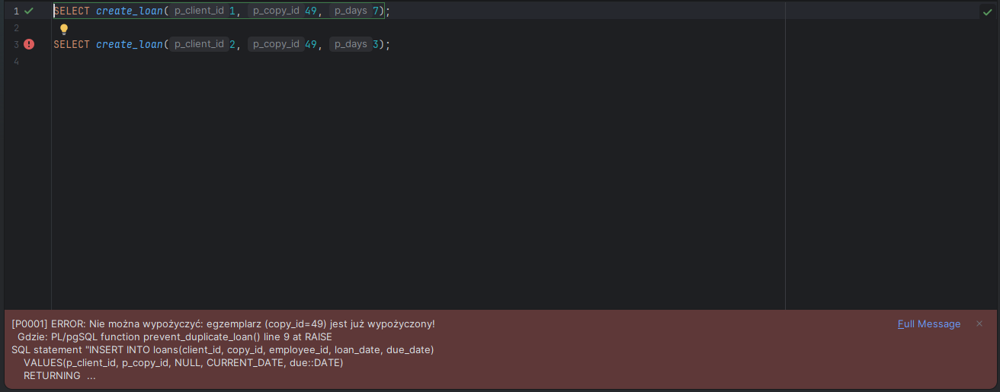
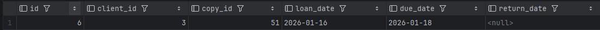
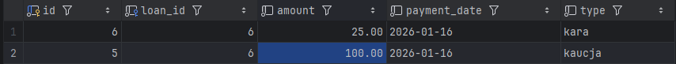
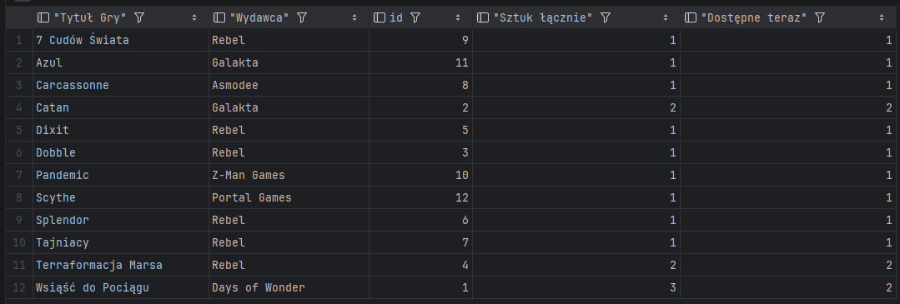

# System Bazy Danych Wypożyczalni Gier Planszowych 🎲

**Projekt zaliczeniowy z przedmiotu:** Bazy Danych (Teleinformatyka AGH)

**Autorzy:** Arkadiusz Baran, Maciej Miłek

---

## 1. Opis Projektu
System służy do kompleksowej obsługi wypożyczalni gier planszowych. Baza danych została zaprojektowana w środowisku **PostgreSQL** i umożliwia:
- Ewidencjonowanie gier, egzemplarzy oraz ich stanu technicznego.
- Zarządzanie bazą klientów i historią ich wypożyczeń.
- Automatyzację procesów finansowych (naliczanie kaucji oraz kar za opóźnienia).
- Raportowanie dostępności gier w czasie rzeczywistym.

Projekt realizuje wymagania na ocenę 4.0 poprzez zastosowanie rozbudowanej struktury tabel (9 encji), widoków oraz logiki biznesowej po stronie serwera (triggery i funkcje).

---

## 2. Struktura Bazy Danych
Baza składa się z **9 tabel** powiązanych relacjami, co zapewnia zgodność z zasadami normalizacji (3NF).

### Schemat ERD (Entity Relationship Diagram)

### Lista Tabel
| Tabela | Opis |
| --- | --- |
| `games` | Katalog tytułów gier (tytuł, rok wydania, kaucja). |
| `copies` | Fizyczne egzemplarze gier (stan, status dostępności). |
| `clients` | Dane osobowe klientów wypożyczalni. |
| `loans` | Rejestr wypożyczeń (kluczowy proces biznesowy). |
| `payments` | Historia transakcji finansowych (kaucje, kary). |
| `employees` | Pracownicy obsługujący system. |
| `publishers` | Słownik wydawców. |
| `categories` | Słownik kategorii gier. |
| `game_categories` | Tabela łącząca (relacja wiele-do-wielu). |

---

## 3. Logika Biznesowa (Triggery i Funkcje)

W systemie zaimplementowano mechanizmy automatyzujące logikę biznesową (Business Logic) bezpośrednio w bazie danych.

### A. Blokada podwójnego wypożyczenia (Trigger)
Trigger `prevent_duplicate_loan` zapobiega sytuacji, w której jeden egzemplarz gry jest wypożyczany dwóm klientom jednocześnie. Jeśli egzemplarz nie został zwrócony, system blokuje nową transakcję, zgłaszając wyjątek.

### B. Automatyczne naliczanie kar (Trigger)
Trigger `apply_overdue_fine` uruchamia się automatycznie przy zwrocie gry. System porównuje datę zwrotu z terminem (`due_date`). Jeśli termin został przekroczony, system wylicza karę (stawka dzienna * liczba dni) i dodaje odpowiedni wpis do tabeli `payments`.

### C. Procedura wypożyczenia (Funkcja)
Funkcja `create_loan(client_id, copy_id, days)` upraszcza proces dodawania rekordu. Automatycznie wylicza datę zwrotu na podstawie długości wypożyczenia i obsługuje logikę kaucji (dodaje wpis płatności, jeśli gra tego wymaga).

---

## 4. Scenariusze Testowe (Dowód Działania)

Poniższe testy potwierdzają poprawność zaimplementowanej logiki oraz spełnienie wymagań projektowych.

### Scenariusz 1: Próba wypożyczenia zajętego egzemplarza
**Cel:** Weryfikacja działania triggera `prevent_duplicate_loan`.
**Działanie:** Próba wypożyczenia egzemplarza, który posiada status aktywnego wypożyczenia (nie został zwrócony).
**Kod SQL:**

    BEGIN;
    SELECT create_loan(1, 49, 7);
    SELECT create_loan(2, 49, 3);
    ROLLBACK;

**Wynik:** System zwraca błąd, operacja zostaje zablokowana przez trigger.

---

### Scenariusz 2: Zwrot po terminie i automatyczne naliczenie kary
**Cel:** Weryfikacja triggera `apply_overdue_fine`.
**Działanie:** Symulacja zwrotu gry 5 dni po terminie.
**Kod SQL:**

    BEGIN;
    
    SELECT create_loan(3, 51, 2) AS loan_id;
    
    SELECT id, client_id, copy_id, loan_date, due_date, return_date
    FROM loans
    WHERE copy_id = 51 AND client_id = 3
    ORDER BY id DESC
    LIMIT 1;
    
    UPDATE loans
    SET due_date = CURRENT_DATE - 5
    WHERE id = (
      SELECT id FROM loans
      WHERE copy_id = 51 AND client_id = 3
      ORDER BY id DESC
      LIMIT 1
    );
    UPDATE loans
    SET return_date = CURRENT_DATE
    WHERE id = (
      SELECT id FROM loans
      WHERE copy_id = 51 AND client_id = 3
      ORDER BY id DESC
      LIMIT 1
    );

    SELECT p.*
    FROM payments p
    JOIN loans l ON l.id = p.loan_id
    WHERE l.copy_id = 51 AND l.client_id = 3
    ORDER BY p.id DESC;

    ROLLBACK;

**Wynik:** System automatycznie dodał rekord do tabeli płatności z kwotą 25.00 PLN (5 dni * 5.00 PLN).

---

### Scenariusz 3: Raport dostępności gier (Advanced SQL)
**Cel:** Weryfikacja poprawności złączeń (`JOIN`) i agregacji danych (`GROUP BY`).
**Działanie:** Wyświetlenie listy gier wraz z wydawcą oraz liczbą dostępnych sztuk w magazynie.
**Kod SQL:**

    BEGIN;
    -- WYPOŻYCZENIE ZE SCENARIUSZA 1 - wpływ na dostępność koppii gry
    -- standardowo istnieją 3 kopie gry o game.id = 1, teraz dostępnych są dwie
    -- SELECT create_loan(1, 49, 7);
    
    SELECT
        g.title AS "Tytuł Gry",
        p.name  AS "Wydawca",
        g.id,
        COUNT(c.id) AS "Sztuk łącznie",
        COUNT(*) FILTER (WHERE c.status = 'DOSTĘPNY') AS "Dostępne teraz"
    FROM games g
    JOIN publishers p ON p.id = g.publisher_id
    LEFT JOIN copies c ON c.game_id = g.id
    GROUP BY g.id, g.title, p.name
    ORDER BY g.title;
    
    ROLLBACK;

**Wynik:** Poprawnie wygenerowany raport magazynowy.

---
